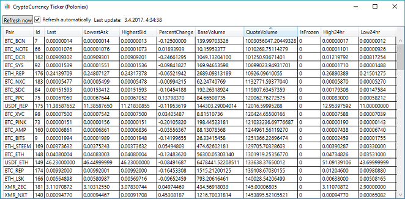

--------------------------------------------------------------------------------

# Windows Installer XML Demo Application
## CryptoCurrency Ticker

A simple Crypto Currency Ticker application for Windows. Target market is
[Poloniex](https://www.poloniex.com).

This topic is used as a simple example of a "useful" application for showcasing
MSI installer building using the
[Windows Installer XML (WIX)](http://wixtoolset.org/).

--------------------------------------------------------------------------------

# Windows Installer XML demo aplikacija
## Praćenje cijena kriptovaluta

Jednostavna Windows aplikacija s pregledom stanja burze kriptovaluta. Ciljana
burza je [Poloniex](https://www.poloniex.com).

Ova tema je odabrana kao jednostavan primjer "korisne" aplikacije za koju se
pokazuju principi rada s [Windows Installer XML (WIX)](http://wixtoolset.org/).

--------------------------------------------------------------------------------



## Digitally sign the MSI

### Create a self-signed certificate

Run "Digital Certificate for VBA Projects" from the Microsoft Office Tools.
You should enter the publisher name, this should create a self signed
certificate with the name "Publisher Name" (i.e. whatevery you enter).

You can examine the certificate in [Start key] > "Manage user certificates".

Note that you should sign all of the binaries before running the WIX build.
This can be done in the BeforeBuild step of the .wixproj XML.

This is an example of signing a file from git-bash on Windows:

```sh
signtool sign
    -n "Publisher Name" \
    -t http://timestamp.comodoca.com/authenticode \
     DemoApp/DemoApp.WIX/bin/Debug/DemoApp.WIX.msi
```
